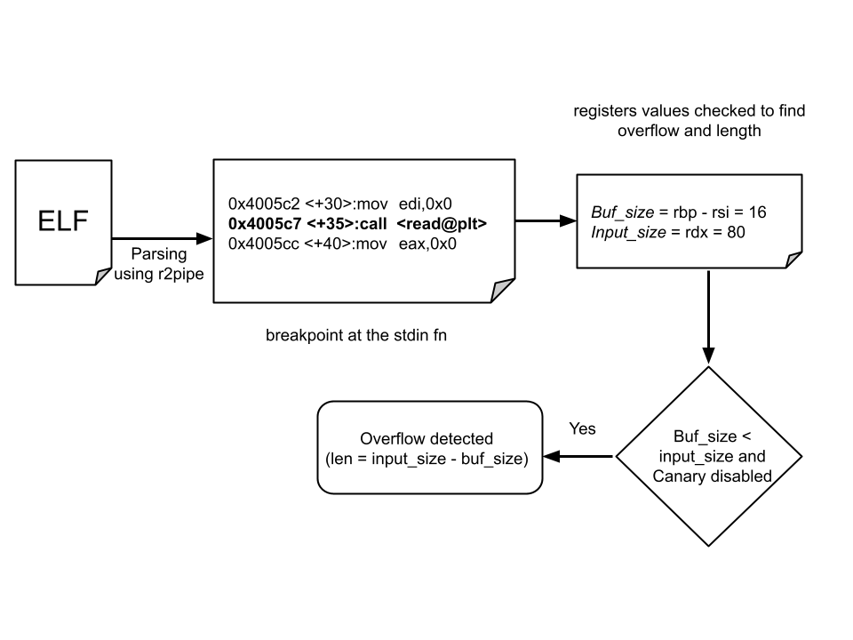

# AngErza

This is a CTF-helper or a program checking (for vulns) tool done as a college project. This tool detects buffer overflow and format string vulnerability in x86 64-bit binary (small sized). It also generates exploit payload for BOF for 3 attacks: RIP overwrite (win function), ROPchain generation using angrop and shellcode (chose among the hardcoded payloads).

## 1. Requirements:

- claripy==9.0.5739
- angr==9.0.5739
- python 3.6
- radare2
- pwntools, pyelftools

## 2. Working:

<p  align="center">

</p>

<p align="center">

</p>

<p  align="center">

</p>

- main.py --> the main worker script of the tool
- lib --> for utility scripts
- trash --> trial purpose scripts


## 3. Installation

```shell
git clone https://github.com/rudyerudite/AngErza.git
cd AngErza
```
Before running AngErza, ensure the all the [requirements](#1-Requirements) are installed. For running AngErza on your binary:

```shell
python3 main.py <test_binary_name>	
```
## 4. TO-DO:
AngErza is a combo of various utility scripts and needs to be IMPROVISED. 

1. Shellcode-Gen:
..1. Auto-generation of shellcode instead of using the hardcoded payloads
..2. Expanding bug scenario (mmap()...)
2. Including attacks which can bypass ASLR and PIE (attacks using program leaks)
3. Enhancing bug-detection for buffer overflow and format string


## References:
1. [https://github.com/ChrisTheCoolHut/Zeratool/]
2. [https://docs.angr.io/core-concepts/toplevel]
3. [https://0x00sec.org/t/autobof-a-journey-into-automation-exploit-development-and-buffer-overflows/13415]
4. [https://research.kudelskisecurity.com/2016/08/08/angr-management-first-steps-and-limitations/]
5. [https://arxiv.org/pdf/1610.00502.pdf]

